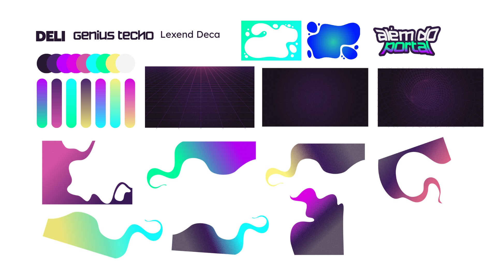
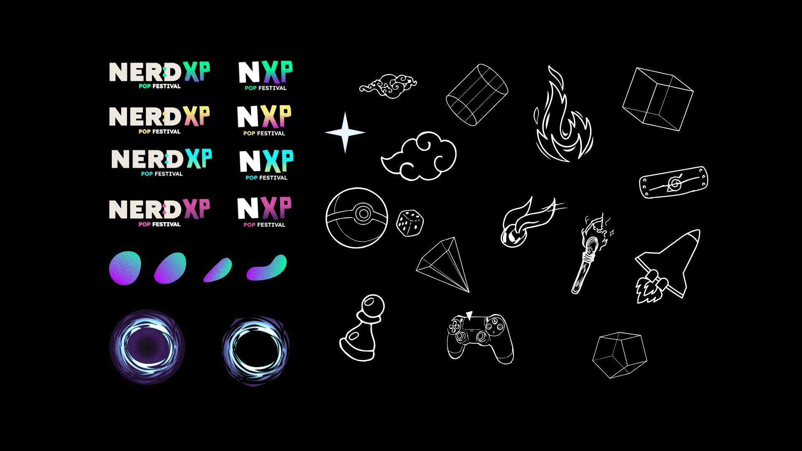

# Especialista em Artes NXP — Nerd Experience & NerdVerso

Protocolo de identidade visual, social media, copy e vídeo do **Nerd Experience Pop Festival 2027** ("além do portal" — 27 e 28/02/2027, Expominas, BH), construído a partir da leitura completa do Canva **"NXP Pop Festival"** (328 páginas, ID `DAHF08WuL5g`) e transformado em **skills** para o Claude.




## O que tem aqui

```
.claude/
├── skills/
│   ├── nxp-especialista/          ← o cérebro: tudo sobre a marca
│   │   ├── SKILL.md               (regra de ouro + índice)
│   │   ├── references/
│   │   │   ├── 01-identidade-e-fatos.md   posicionamento, público, datas, ingressos, programas, cosplay
│   │   │   ├── 02-logo.md                 NERD:XP, NXP, "além do portal", variações
│   │   │   ├── 03-cores.md                9 cores + 7 degradês (HEX amostrados), modos, mundos
│   │   │   ├── 04-tipografia.md           Genius Techo, Deli, Lexend Deca + hierarquia
│   │   │   ├── 05-elementos-graficos.md   portal, blobs, grid, ícones, pills, faixas, fotos, mascotes
│   │   │   ├── 06-formatos-e-layouts.md   medidas, zonas seguras, 8 layouts-padrão
│   │   │   ├── 07-voz-e-copy.md           personalidade, vocabulário, fórmulas, legendas, erros proibidos
│   │   │   ├── 08-nerdverso-lore.md       mundos, N.E.R.D. × PaTech, todos os personagens
│   │   │   ├── 09-biblioteca-canva.md     mapa das 328 páginas por campanha
│   │   │   ├── 10-social-media-playbook.md fases, pilares, cadência, sequências, métricas
│   │   │   ├── 11-video-e-motion.md       reels, motion, roteiros, comandos ffmpeg
│   │   │   ├── 12-canva-workflow.md       produção segura via Canva MCP
│   │   │   ├── 13-checklist-qa.md         checklist de publicação
│   │   │   └── 14-exemplos.md             7 exemplos completos (briefing → arte → legenda)
│   │   └── assets/                brand boards, exemplos reais, tokens.css, palette.json
│   ├── nxp-criar-post/            ← fluxo de criação
│   ├── nxp-revisar-arte/          ← fluxo de revisão (veredito + correções)
│   └── nxp-planejar-campanha/     ← calendário e campanhas
├── agents/nxp-diretor-de-arte.md  ← subagente para trabalhos grandes
└── product-marketing.md           ← contexto lido por skills de marketing de terceiros
nxp-brand/
├── README.md                      ← você está aqui
├── SKILLS.md                      ← quais skills cada função precisa + como instalar
└── claude-ai-projeto.md           ← instruções para colar num Projeto do claude.ai
scripts/
├── instalar-no-mac.sh             ← instala tudo no ~/.claude do Mac
└── empacotar-para-claude-ai.sh    ← gera .zip das skills para upload no claude.ai
```

## Como usar

### 1. Aqui no Claude Code (nuvem) ou abrindo este repositório no Mac
Nada a instalar: as skills em `.claude/skills/` carregam sozinhas quando você abre o Claude Code na pasta do repo. Peça naturalmente:

- "Cria um feed anunciando que o 2º lote acaba domingo"
- "Revisa essa arte" (anexe a imagem) · "Revisa a página 214 do Canva"
- "Monta o calendário de novembro do NXP"
- "Escreve o roteiro de um reels de 15s sobre o Next Level"
- "Cria o carrossel de apresentação da Gabi, a Garça Lutadora"

### 2. No Mac, em qualquer pasta (instalação global)
```bash
git clone <este repositório> && cd nerd-exp
./scripts/instalar-no-mac.sh
```
Copia as 4 skills + subagente para `~/.claude/`. Depois instale as skills de terceiros recomendadas (comandos em [SKILLS.md](SKILLS.md)).

### 3. No claude.ai / app Claude (desktop, web, celular)
Opção A — **Skills** (recomendado): `./scripts/empacotar-para-claude-ai.sh` → Configurações → Capacidades → Skills → faça upload de `dist/claude-ai/nxp-especialista.zip` e depois dos outros.
Opção B — **Projeto**: crie um Projeto "NXP — Direção de Arte", cole [claude-ai-projeto.md](claude-ai-projeto.md) nas instruções e anexe os arquivos de `references/` e os brand boards.
Em ambos: conecte o **Canva** em Configurações → Conectores.

## Resumo relâmpago da identidade

| | |
|---|---|
| **Conceito** | Portal para o NerdVerso — épico, neon, gamer, comunitário |
| **Cores** | `#291833` berinjela (fundo) · `#BD00FD` violeta · `#11FAFE` ciano · `#01FF9F` verde · `#F7F080` amarelo · `#DA05E2` magenta · `#D352A6` rosa · `#49236C` roxo · `#F4F4F4` branco |
| **Fontes** | Genius Techo (títulos, caixa-alta) · Deli (impacto/logo) · Lexend Deca (texto) |
| **Elementos** | Portal-vórtice, blobs líquidos com granulado, grid/túnel synthwave, ícones de traço branco, pills, faixas marquee, recortes com energia |
| **Assinatura** | NERD:XP + além do portal · **27 e 28** (verde) FEVEREIRO DE 2027 · [NO EXPOMINAS] |
| **Voz** | Exploradores, portal, missão, loot, XP, Player 2 — épica, brincalhona, acolhedora |

## Pendências para a produção confirmar

Coisas que aparecem de forma inconsistente no Canva (detalhes em `01-identidade-e-fatos.md` e `13-checklist-qa.md`):
- Regra de meia-entrada ("Menores de 21 anos"?).
- Páginas-modelo com "13 e 14 de março de 2027" e "26, 27 e 28 de fevereiro".
- Status do Érico Borgo como atração; grafia "Mauro Horta" vs "Mario Horta".
- Cores oficiais de cada mundo (Lótus, Pixel, Eldarion, Nexos) — as do protocolo foram amostradas das artes.
- Conteúdo do Brand Kit "nerd" no Canva (vale completar com as 9 cores, 3 fontes e logos).
